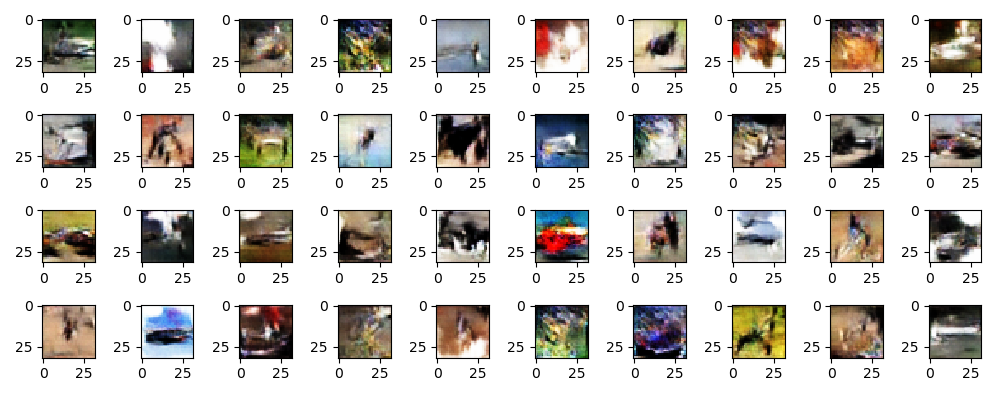
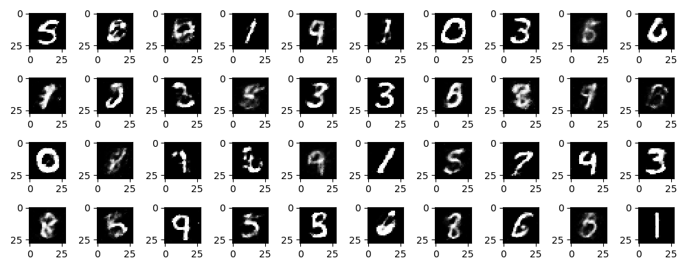

# Generative Adversarial Network

Basic Generative Adversarial Network implementation. These networks learn to generate images from noise similar to the dataset they were trained on.

## CIFAR-10 Dataset

## MNIST Dataset

