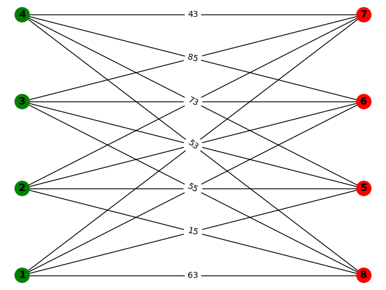
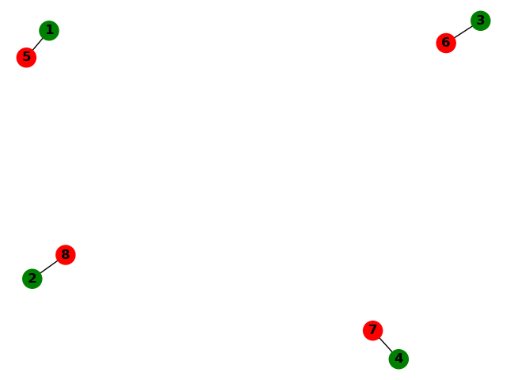

# Graph

Solving data assocation with deep learning. Related to matching targets for tracking in videos. To properly train we must find all solutions to a given matrix. If there is more than one, neither is more correct than the either.

Affinity weights between targets:

 

Best match:

