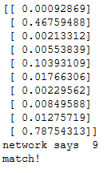

# Neural Net Numbers

Implements a neural network from scratch to classify the MNIST dataset.

Based off the tutorial from [Make Your Own Neural Network](https://www.amazon.com/Make-Your-Own-Neural-Network-ebook/dp/B01EER4Z4G), by Tariq Rashid

## 
A nine I drew, took a picture of with my phone and filtered:

 
